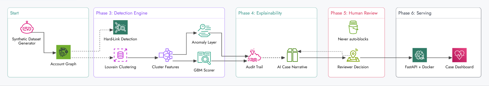

# RingSentinel

**Explainable abuse-ring detection for payment platforms — built for the Razorpay AI Buildathon, Track 2: AI Risk Manager.**

RingSentinel detects coordinated fraud rings — accounts that look independent individually but share hidden infrastructure (devices, payment instruments, addresses) — using a layered graph + machine learning pipeline, with full explainability and a strict defense-only action policy: the system flags for human review, it never blocks anything automatically.

---

## Architecture



**The pipeline, in words:**

1. **Synthetic Dataset Generator** — accounts, devices, payment instruments, addresses, and transactions, with injected abuse rings at a tunable subtlety level, plus deliberately noisy "coincidental overlap" clusters to stress-test false positives.
2. **Account Graph** — entity resolution turns flat records into a weighted account-account graph, edge weight = number of distinct shared signal types (device, instrument, address).
3. **Detection Engine** — three independent methods, not one sequential pipeline:
   - **Hard-Link Detection**: connected components on strong multi-signal edges. A standalone safety-net metric — perfect precision, low recall, not merged into the final output.
   - **Louvain Clustering → Cluster Features → GBM Scorer**: community detection finds candidate clusters; a gradient-boosted classifier (XGBoost), cross-validated, scores them on behavioral and structural features.
   - **Anomaly Layer**: an unsupervised IsolationForest, running in parallel to the GBM on the same cluster features, catching structurally unusual clusters independent of the supervised model.
4. **Explainability** — every flagged cluster gets a case file: exact shared-entity evidence, a feature snapshot with anomalous values flagged against the population baseline, and an AI-generated plain-English narrative (Groq) grounded in that evidence **and** in retrieval over past reviewer decisions — a lightweight RAG layer with no vector database, just structured similarity search over the system's own decision history.
5. **Human Review** — every case is `FLAGGED_FOR_HUMAN_REVIEW`, hardcoded. A reviewer records `confirmed_fraud` / `false_positive` / `needs_more_info`, and that decision feeds back into future narrative retrieval — the system's evidence base grows with every case reviewed.
6. **Serving** — a FastAPI backend (containerized, Docker-verified) and a single-file vanilla JS dashboard: searchable case queue, adjustable decision threshold, evidence graphs, and live on-demand scoring.

---

## Honest evaluation — read this before trusting any number below

Our first fully-trained model scored **100% precision and 100% recall**. We didn't trust that. A 5-fold cross-validated depth experiment showed a bare decision-stump classifier scored **98%** — proof the synthetic dataset was too cleanly separable, not proof the model was excellent. We traced this to specific generator flaws (unrealistically tight ring activity windows, non-overlapping transaction amounts between rings and normal accounts) and rebuilt the generator before trusting results again.

A follow-up graph-embeddings experiment — testing whether AI-learned structural features could beat hand-engineered ones — honestly returned a **0.0% delta**. We reported that rather than hiding a negative result; the reason (the task was already near-maximally separable) was itself informative.

**Current representative numbers** (regenerate with `python run_pipeline.py` for a fresh run — these will vary slightly seed to seed):

| Stage | Precision | Recall |
|---|---|---|
| Hard-link (baseline) | ~100% | ~17-22% |
| Louvain clustering | ~65-70% | ~60-65% |
| GBM scorer (held-out test) | ~95-100% | ~85-95% |
| + Anomaly layer | adds 0-2 true-ring catches GBM alone missed, 0 false positives |

---

## Repo structure

```
ringsentinel/
├── pipeline/
│   ├── config.py                single source of truth for all parameters
│   ├── utils.py                  seeded ID generation (deliberately not uuid4 — see below)
│   ├── generate_dataset.py       Stage 1
│   ├── build_graph.py            Stage 2
│   ├── hard_link_detection.py    Stage 3
│   ├── louvain_detection.py      Stage 4
│   ├── gbm_scorer.py             Stage 5
│   ├── graph_embeddings.py       Experiment: does AI-learned structure beat hand-engineered features?
│   ├── depth_experiment.py       Experiment: does model capacity matter, or is the data too easy?
│   ├── anomaly_layer.py          Stage 5b — unsupervised, parallel to GBM
│   ├── case_retrieval.py         RAG over past reviewer decisions
│   ├── llm_narrative.py          AI case narrative generation (Groq)
│   └── audit_layer.py            Stage 6 — explainability + audit trail
├── run_pipeline.py               orchestrator — runs all stages in order, one process
├── api/
│   ├── app/main.py                FastAPI: /health, /rings, /audit/{id}, /audit/{id}/narrative,
│   │                               /audit/{id}/decision, /score-ring
│   ├── requirements.txt
│   ├── Dockerfile
│   └── README.md
├── frontend/
│   └── index.html                 single-file dashboard — no build step, no framework
├── data/                          generated — gitignored, not committed
├── .env                           GROQ_API_KEY — gitignored, never committed
├── DATASET_SPEC.md                synthetic dataset design, incl. difficulty presets
└── requirements.txt
```

---

## Running it

```bash
# One-time setup
python -m venv venv
source venv/bin/activate          # Windows: .\venv\Scripts\Activate.ps1
pip install -r requirements.txt
pip install python-dotenv groq

# Add your Groq key (get one free at console.groq.com/keys)
echo "GROQ_API_KEY=your_key_here" > .env

# Generate data, train, evaluate
python run_pipeline.py

# Serve the API
cp -r data api/data                # Windows: Copy-Item -Recurse data api\data -Force
cd api && pip install -r requirements.txt
uvicorn app.main:app --port 8000

# In a second terminal — serve the dashboard
cd frontend
python -m http.server 5500
```

Open `http://localhost:5500`.

### Docker (alternative to running the API directly)

```bash
cd api
docker build -t ringsentinel-api .
docker run --rm -v $(pwd)/../data:/app/data -p 8000:8000 ringsentinel-api
```

---

## API endpoints

| Endpoint | Purpose |
|---|---|
| `GET /health` | liveness check |
| `GET /rings?decision_threshold=` | list flagged clusters, threshold-adjustable |
| `GET /audit/{cluster_id}` | full case file: evidence, features, anomalies |
| `GET /audit/{cluster_id}/narrative` | AI-generated case summary, RAG-grounded |
| `POST /audit/{cluster_id}/decision` | record a reviewer verdict |
| `GET /audit/{cluster_id}/decisions` | decision history for a case |
| `POST /score-ring` | score an arbitrary candidate group on demand |

---

## Key design decisions

- **No label leakage**: `labels_HELD_OUT.csv` (ground truth) is read only in `gbm_scorer.py` (training) and `audit_layer.py` (building already-flagged cases' evidence). No detection stage ever touches it.
- **Deterministic by design**: all randomness routes through the seeded `random` module. `uuid.uuid4()` was deliberately avoided after we found it silently ignores `random.seed()`, breaking reproducibility.
- **Defense-only, structurally**: `action` is hardcoded to `FLAGGED_FOR_HUMAN_REVIEW` or `NOT_FLAGGED`. No code path can trigger an automated block — this is enforced in code, not just claimed in documentation.
- **Cluster-level train/test splits**: never account-level — a cluster's accounts are entirely in train or entirely in test.
- **RAG without a vector database**: case-retrieval similarity is computed over the same seven structured features the GBM already trusts (z-score normalized cosine similarity), not text embeddings — deterministic, no embedding API call, retrieves in the same signal space the detector already uses.

## What this is not

This is buildathon-grade engineering applied with production discipline — held-out evaluation, no label leakage, containerized deployment — not a production-hardened service. It has no authentication, no rate limiting, and no automated test suite yet. Real-time continuous transaction ingestion is a natural next step; the current system provides on-demand real-time scoring (`/score-ring`), not always-on stream processing. These are stated scope boundaries, not oversights.

## Build challenges

See the buildathon submission's "Build Challenges" field for the full account — highlights include a `uuid4`/seeding reproducibility bug, two rounds of fixing an over-separable synthetic dataset, a missing-CORS bug invisible to command-line testing but fatal in-browser, and three sequential fixes to get an LLM narrative call working against a reasoning model (deprecated model name → outdated SDK → reasoning-token budget exhaustion).
